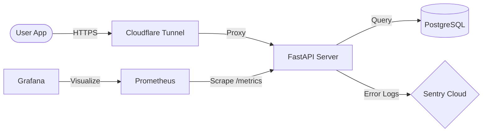

# AI Quiz & Guide Generator - Backend API (Mutsa Rocketdan)

멋사 로켓단 프로젝트의 중심 역할을 하는 백엔드 API 서버입니다. 사용자 인증, 강의 자료 관리, AI 작업 트래킹 및 데이터 영속성을 담당하며 프로덕션 환경에 최적화된 모니터링과 보안 체계를 갖추고 있습니다.

---

## 🚀 주요 기술 스택

- **FastAPI**: 현대적이고 성능이 뛰어난 웹 프레임워크
- **PostgreSQL 16**: 안정적인 관계형 데이터베이스
- **Docker & Docker Compose**: 일관된 개발 및 배포 환경 구축 (Multi-Container 환경)
- **SQLAlchemy & Alembic**: 데이터베이스 ORM 및 마이그레이션 관리
- **JWT (python-jose)**: 무상태(Stateless) 기반 사용자 인증
- **Cloudflare Tunnel**: 도메인 없이 안전한 외부 노출 (HTTPS 지원)
- **Monitoring (Sentry, Prometheus, Grafana)**: 에러 트래킹 및 메트릭 시각화
- **Security (SlowAPI)**: 실시간 요청 제한(Rate Limiting) 및 보안 강화

---

## 🛡️ 모니터링 및 보안 서비스 (New!)

본 백엔드는 실제 운영 환경을 고려하여 다음과 같은 관리 시스템이 통합되어 있습니다.

| 구분 | 서비스 | 포트(Host) | 주요 역할 |
| :--- | :--- | :--- | :--- |
| **에러 트래킹** | **Sentry** | - | 실시간 서버 내부 에러 및 예외 코드 분석 |
| **메트릭 수집** | **Prometheus** | **9091** | 서버 리소스 및 API 호출 통계 수집 |
| **시각화** | **Grafana** | **3001** | 수집된 메트릭의 시각화 및 통합 대시보드 |
| **접속 보호** | **Basic Auth** | - | `/docs` (Swagger UI) 및 `/redoc` 접근 보호 |
| **공격 방어** | **Rate Limit** | - | 특정 IP의 무분별한 요청 차단 (DOS 방지) |

---

## 🛠 주요 기능

- **회원 인증 (Auth)**: JWT 토큰 기반의 회원가입 및 로그인 시스템
- **강의 관리 (Lecture)**: 강의 자료 업로드 및 목록 상세 조회
- **AI 작업 트래킹 (Task)**: 비동기 방식의 지식 추출 작업 진행 상태 추적 (Progress % 지원)
- **기능 인터페이스**: AI 파이프라인과 연결 가능한 통합 서비스 구조 (`ai_service.py`)
- **보안 가드**: CORS 설정 및 모든 API 엔드포인트에 대한 보안 적용

---

## 📊 시스템 아키텍처



---

## 🏗 설치 및 실행 방법

### 1. 환경 변수 설정
프로젝트 루트 폴더에 `.env` 파일을 생성하고 아래 내용을 설정합니다.
```env
# Database
POSTGRES_USER=myuser
POSTGRES_PASSWORD=mypassword
POSTGRES_DB=quiz_db
DB_EXTERNAL_PORT=5433

# API
API_EXTERNAL_PORT=8001
SECRET_KEY=your-super-secret-key
ALGORITHM=HS256
ACCESS_TOKEN_EXPIRE_MINUTES=30

# Monitoring (Ports: 9091, 3001)
PROMETHEUS_EXTERNAL_PORT=9091
GRAFANA_EXTERNAL_PORT=3001
SENTRY_DSN=your_sentry_dsn_here

# Security
DOCS_USERNAME=admin
DOCS_PASSWORD=your_docs_password
```

### 2. 도커 실행
```powershell
docker-compose up -d --build
```

---

## 📚 API 문서 액세스

본 서버는 시스템 노출 방지를 위해 **기본 인증(Basic Auth)**이 적용되어 있습니다.

- **Swagger UI**: `http://localhost:8001/docs` (로컬) 또는 `External Tunnel URL/docs`
- **인증 정보**: `.env` 파일에 설정한 `DOCS_USERNAME`, `DOCS_PASSWORD` 사용

---

## 📁 저장소 역할 구분
본 저장소는 **백엔드 API** 전용입니다. 다른 요소들과 협업 시 아래 저장소를 참조하세요.
- **AI 로직**: [AI-Pipeline](https://github.com/Mutsa-Rocketdan/AI-Pipeline)
- **프론트엔드**: [Frontend-App](https://github.com/Mutsa-Rocketdan/Frontend-App)

> [!IMPORTANT]
> **팀 협업 주의사항**
> 1. **터널 주소 수동 공지**: 서버 재시작 시 `docker logs quiz_guide_tunnel` 명령어로 바뀐 주소를 팀원에게 즉시 공유해야 합니다.
> 2. **보안 비밀번호**: `DOCS_PASSWORD`는 초기 설정 후 반드시 본 프로젝트의 특수성에 맞게 수정하여 관리해 주세요.

---
© 2026 Mutsa Rocketdan
