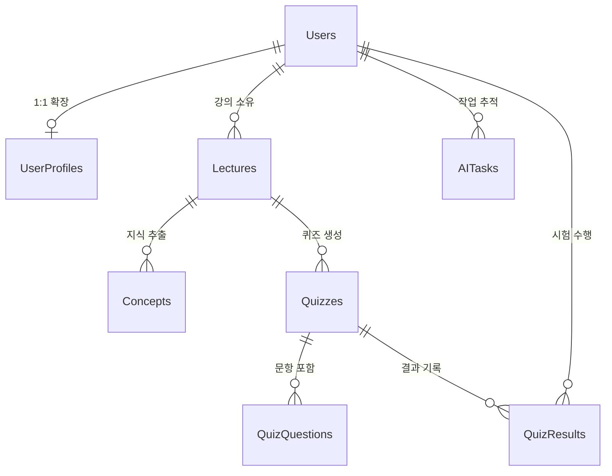

# AI Quiz & Guide Generator - Backend API (Mutsa Rocketdan)

멋사 로켓단 프로젝트의 중심 역할을 하는 백엔드 API 서버입니다. 사용자 인증, 강의 자료 관리, AI 작업 트래킹 및 데이터 영속성을 담당합니다.

## 🚀 주요 기술 스택
- **FastAPI**: 현대적이고 성능이 뛰어난 웹 프레임워크
- **PostgreSQL**: 안정적인 관계형 데이터베이스
- **Docker & Docker Compose**: 일관된 개발 및 배포 환경 구축
- **SQLAlchemy**: 강력한 Python SQL 툴킷 및 ORM
- **JWT (python-jose)**: 무상태(Stateless) 기반 사용자 인증
- **Alembic**: 데이터베이스 마이그레이션 관리

## 🛠 주요 기능
- **회원 인증 (Auth)**: JWT 토큰 기반의 회원가입 및 로그인 시스템
- **강의 관리 (Lecture)**: 강의 자료 업로드 및 목록 상세 조회
- **AI 작업 트래킹 (Task)**: 비동기 방식의 지식 추출 작업 진행 상태 추적 (Progress % 지원)
- **기능 인터페이스**: AI 파이프라인과 연결 가능한 통합 서비스 구조 (`ai_service.py`)

## 📊 데이터베이스 구조 (Database Schema)

본 프로젝트는 지식의 추출과 개인화된 학습 트래킹을 위해 체계적인 관계형 모델을 사용합니다.

### ERD (Entity Relationship Diagram)



### 테이블 상세 역할
- **Users**: 회원의 기본 계정 정보 및 인증 관리
- **Lectures**: 사용자가 업로드한 원본 강의 텍스트 및 메타데이터
- **Concepts**: 강의에서 AI가 추출한 핵심 지식 단위 및 숙련도(Mastery) 정보
- **Quizzes & Questions**: 생성된 퀴즈 한 묶음과 객관식 문항 데이터
- **QuizResults**: 사용자가 제출한 답안, 최종 점수 및 AI 맞춤 피드백
- **AITasks**: 비동기로 진행되는 AI 연산의 실시간 상태(Progress %)

## 🏗 설치 및 실행 방법

### 1. 사전 준비
- Docker 및 Docker Compose가 설치되어 있어야 합니다.

### 2. 환경 변수 설정
프로젝트 루트 폴더에 `.env` 파일을 생성하고 아래 내용을 설정합니다.
```env
# Database
POSTGRES_USER=myuser
POSTGRES_PASSWORD=mypassword
POSTGRES_DB=quiz_guide_db
DATABASE_URL=postgresql://myuser:mypassword@db:5432/quiz_guide_db

# API
API_EXTERNAL_PORT=8001
JWT_SECRET_KEY=your_secret_key_here  # 실제 서비스 시 복잡한 키로 변경 필수
ALGORITHM=HS256
ACCESS_TOKEN_EXPIRE_MINUTES=60
```

### 3. 도커 실행
```powershell
docker-compose up -d --build
```

### 4. 데이터베이스 초기화 (마이그레이션)
컨테이너 실행 후 아래 명령어로 DB 테이블을 생성합니다.
```powershell
docker-compose exec api alembic upgrade head
```

## 📚 API 문서 확인
서버 실행 후 브라우저를 통해 실시간 API 문서를 확인할 수 있습니다.
- **Swagger UI**: [http://localhost:8001/docs](http://localhost:8001/docs)
- **ReDoc**: [http://localhost:8001/redoc](http://localhost:8001/redoc)

## 📁 저장소 역할 구분
본 저장소는 **백엔드 API** 코드만을 포함합니다.
- **AI 로직**: [AI-Pipeline](https://github.com/Mutsa-Rocketdan/AI-Pipeline) 레포지토리에서 별도 관리
- **프론트엔드**: [Frontend-App](https://github.com/Mutsa-Rocketdan/Frontend-App) 레포지토리에서 별도 관리

---
© 2026 Mutsa Rocketdan
