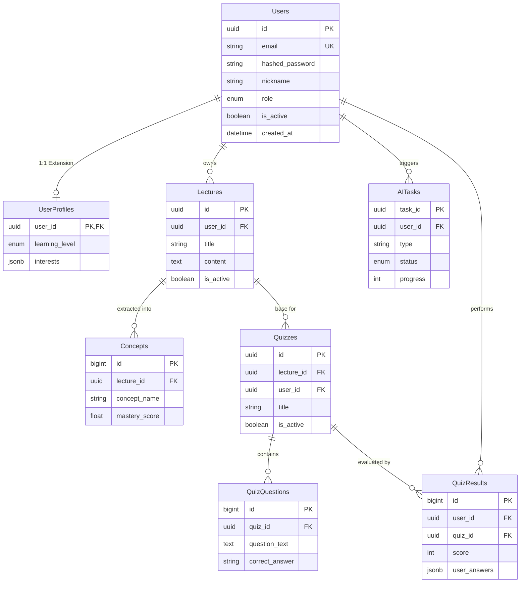

# Backend Database Schema: PostgreSQL & Entity Relationship
 
이 문서는 시스템의 핵심 데이터 구조와 아키텍처 설계를 기술합니다. 상세 구현 일정은 [Implementation Plan](./backend_db_implementation_plan.md)을 참조하세요.

## 1. 시스템 아키텍처 (System Architecture)
 
- **Database**: `PostgreSQL 16` (Docker Managed)
- **Framework**: `FastAPI` (Asynchronous API Server)
- **Container**: `Docker` & `Docker Compose`
- **ORM**: `SQLAlchemy` + `Alembic` (Database Migration)
- **Authentication**: `JWT (JSON Web Token)` 기반 무상태 인증
 
## 2. 데이터베이스 스키마 설계 (ERD Draft)
 
### 2.0 테이블 요약 및 역할
본 백엔드 시스템은 데이터의 무결성과 앱 연동의 효율성을 위해 다음과 같은 테이블들로 구성됩니다.
 
- **Users (사용자 계정)**: 시스템의 모든 권한 및 인증의 주체가 되는 계정 핵심 정보.
- **UserProfiles (확장 프로필)**: 개인화된 학습 경험을 위한 부가 정보(학습 수준, 관심사, 알림 설정 등).
- **Lectures & Materials (강의 자료)**: 퀴즈 생성 및 검색의 바탕이 되는 원본 콘텐츠 및 벡터 데이터 저장소.
- **Concepts & Mastery (개념 학습 도표)**: 강의 내 지식의 최소 단위와 사용자의 학습 진척도(숙련도)를 추적.
- **AITasks (비동기 작업 상태)**: 실행 시간이 긴 AI 연산의 현재 진행률을 앱에 실시간으로 공유.
- **Quizzes & Questions (학습 콘텐츠)**: 자동으로 생성된 퀴즈 한 묶음과 그에 속한 객관식/주관식 문항들.
- **QuizResults (학습 및 수행 결과)**: 사용자의 실제 풀이 결과와 점수, 그리고 AI가 분석한 개인별 피드백 저장.
 
### 2.0.1 ERD (Entity Relationship Diagram)
 

 
### 2.1 Users (사용자 계정)
*서비스 이용자를 식별하고 로그인을 처리하기 위한 핵심 계정 정보를 관리합니다.*
| Field | Type | Description |
| :--- | :--- | :--- |
| `id` | UUID (PK) | 고유 식별자 |
| `email` | String (Unique) | 로그인 계정 |
| `hashed_password` | String | 암호화된 비밀번호 |
| `nickname` | String | 사용자 별명 |
| `role` | Enum | 계정 권한 (USER, ADMIN) |
| `is_active` | Boolean | 계정 활성 상태 |
| `created_at` | DateTime | 가입 일시 |
 
### 2.2 UserProfiles (확장 프로필)
| Field | Type | Description |
| :--- | :--- | :--- |
| `user_id` | UUID (FK) | Users 테이블 참조 |
| `learning_level` | Enum | 입문/중급/고수 등 학습 단계 |
| `interests` | JSONB | 관심 분야 태그 리스트 |
| `fcm_token` | String | 앱 푸시 알림용 토큰 |
 
### 2.3 Lectures & Materials (강의 자료)
| Field | Type | Description |
| :--- | :--- | :--- |
| `id` | UUID (PK) | 강의 식별자 |
| `user_id` | UUID (FK) | 업로드한 사용자 |
| `title` | String | 강의 제목 |
| `content` | Text | 전체 스크립트 텍스트 |
| `is_active` | Boolean | 활성 상태 (Soft Delete 여부) |
| `vector_embedding` | Vector | (pgvector 도입 시) 검색용 임베딩 값 |
 
### 2.4 Concepts & Mastery (개념 학습 도표)
| Field | Type | Description |
| :--- | :--- | :--- |
| `id` | BigInt (PK) | 개념 식별자 |
| `lecture_id` | UUID (FK) | 소속 강의 |
| `concept_name` | String | 개념 이름 (예: 'Backpropagation') |
| `description` | Text | 개념 설명 |
| `mastery_score` | Float | 사용자의 이해도 점수 (AI 분석 결과) |
 
### 2.5 AITasks (비동기 작업 상태)
| Field | Type | Description |
| :--- | :--- | :--- |
| `task_id` | UUID (PK) | 작업 식별자 |
| `type` | String | 퀴즈 생성 / 가이드 생성 등 |
| `status` | Enum | PENDING, PROCESSING, COMPLETED, FAILED |
| `progress` | Integer | 진행률 (0~100) |
| `result_url` | String | 완료 후 결과물 접근 주소 |
 
| Field | Type | Description |
| :--- | :--- | :--- |
| `id` | UUID (PK) | 퀴즈 식별자 |
| `lecture_id` | UUID (FK) | 소속 강의 |
| `user_id` | UUID (FK) | 생성한 사용자 |
| `title` | String | 퀴즈 제목 |
| `is_active` | Boolean | 활성 상태 (Soft Delete 여부) |
 
### 2.7 QuizResults (학습 및 수행 결과)
| Field | Type | Description |
| :--- | :--- | :--- |
| `id` | BigInt (PK) | 결과 식별자 |
| `user_id` | UUID (FK) | 수행한 사용자 |
| `quiz_id` | UUID (FK) | 푼 퀴즈 식별자 |
| `score` | Integer | 점수 |
| `user_answers` | JSONB | 사용자가 제출한 답안 리스트 |
| `ai_feedback` | Text | 개인화 학습 가이드 |
| `created_at` | DateTime | 수행 완료 일시 |
